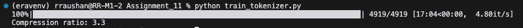

# Sanskrit BPE Tokenizer

A byte pair encoding (BPE) tokenizer specifically designed for Sanskrit text processing.

## Training log



## Features

- Vocabulary size: 4,999 tokens (under the 5,000 token limit)
- Compression ratio: 3.3
- Specialized for Sanskrit text processing
- Efficient encoding and decoding

## Installation

```bash
pip install -r requirements.txt
```

## Usage

```python
from bpe_tokenizer import SanskritBPETokenizer

# Initialize tokenizer
tokenizer = SanskritBPETokenizer(vocab_size=4999)

# Train on your data
tokenizer.fit(texts)

# Encode text
encoded = tokenizer.encode("यथा ह्येकेन चक्रेण न रथस्य गतिर्भवेत्")

# Decode tokens
decoded = tokenizer.decode(encoded)
```

### Example Texts

The repository includes two example Sanskrit texts:

**Example 1:**
```sanskrit
यथा ह्येकेन चक्रेण न रथस्य गतिर्भवेत्।
एवं परुषकारेण विना दैवं न सिद्ध्यति।।
```

**Example 2:**
```sanskrit
उद्यमेन हि सिध्यन्ति कार्याणि न मनोरथैः! न हि सुप्तस्य सिंहस्य प्रविशन्ति मुखे मृगाः !
```

## Training Data

The tokenizer was trained on the [Sanskrit-Llama dataset](https://huggingface.co/datasets/VinitT/Sanskrit-Llama) from HuggingFace.

## HuggingFace Space

You can try out the tokenizer in our [HuggingFace Space](https://huggingface.co/spaces/Perpetualquest/SanskritBPE)

## Performance Metrics

- Vocabulary Size: 4,999 tokens
- Compression Ratio: 3.3
