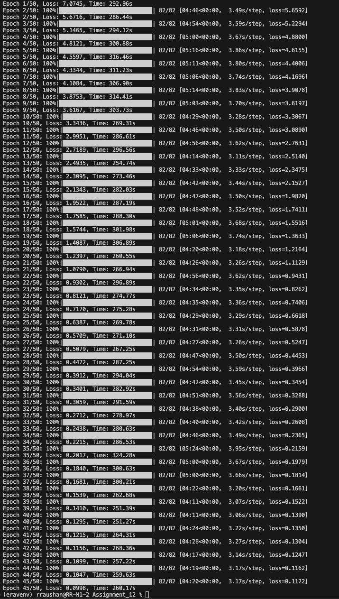
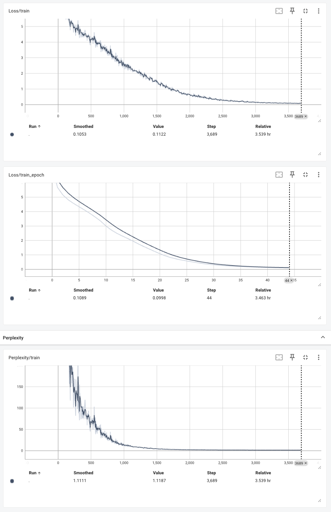
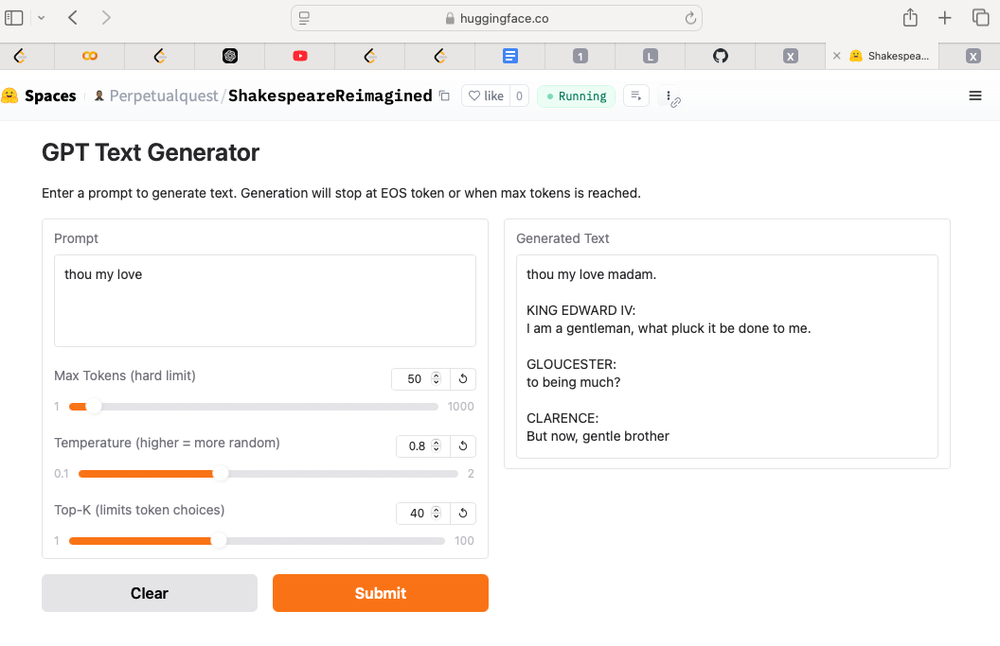

# Custom GPT Implementation and Training

This repository contains a custom implementation of the GPT (Generative Pre-trained Transformer) model architecture, along with training scripts and a web interface for text generation.

## Project Structure
    ├── transformer.py       # GPT model implementation
    ├── train.py             # Training script
    ├── lr_finder.py         # Learning rate finder utility
    ├── app.py               # Gradio web interface
    ├── requirements.txt     # Project dependencies
    └── input.txt            # Training data

## Features

- **Custom GPT implementation** based on the original architecture.
- **Learning rate finder** with TensorBoard visualization.
- **Training script** with configurable parameters.
- **Gradio web interface** for text generation.
- **TensorBoard integration** for training monitoring.

## Model Architecture

The implementation includes:
- Multi-head self-attention.
- Position-wise feed-forward networks.
- Layer normalization.
- Residual connections.

Key configurations:
- Vocabulary size: 50,257 (GPT-2 tokenizer).
- Maximum sequence length: 1024.
- Configurable number of layers and attention heads.

## Training Details

- **Optimizer**: AdamW.
- **Learning rate scheduling**: StepLR.
- **Weight initialization**: Following the GPT-2 paper.
- **Target**: To get loss below 0.09.
- **Hardware**: Trained on Apple M1 Mac, using MPS acceleration.
- **Total Epochs**: 45
- **Batch size, Tokens**: 16; 256
- **Training Time**: sligtly less than 4 hours

## Training logs:

## Tensorboard Monitoring:

## Huggingface Spaces:

The model is deployed as an app on [huggingface space](https://huggingface.co/spaces/Perpetualquest/ShakespeareReimagined)

## Installation

1. Clone the repository:
   git clone https://github.com/Rakesh-Raushan/era-misc-sandbox.git
   cd era-misc-sandbox/Assignment_12

2. Install dependencies:
   pip install -r requirements.txt

## Usage

### Finding the Optimal Learning Rate

Run the learning rate finder to determine the optimal learning rate:
python lr_finder.py

This will:
- Perform multiple iterations of learning rate search.
- Save visualization plots.
- Log results to TensorBoard.
- Save findings to `lr_finder_results.json`.

### Training the Model

Train the model using:
python train.py

Monitor training progress using TensorBoard:
tensorboard --logdir=logs

### Running the Web Interface

Start the Gradio web interface for text generation:
python app.py

## Contributing

Contributions are welcome! Please feel free to submit a Pull Request.

## Acknowledgments

- Based on the GPT architecture by OpenAI.
- Inspired by Andrej Karpathy's minGPT implementation.
