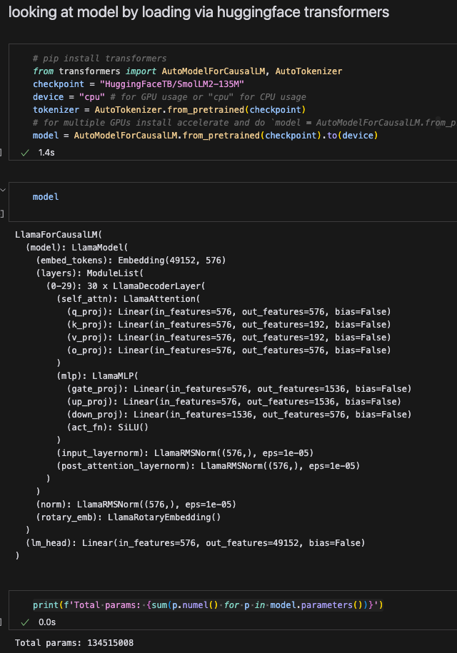
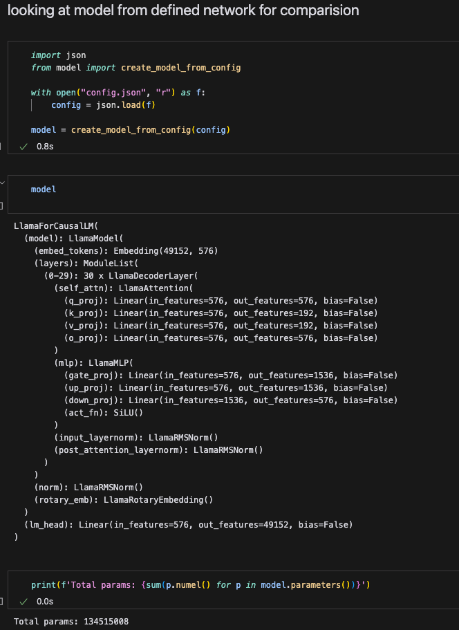
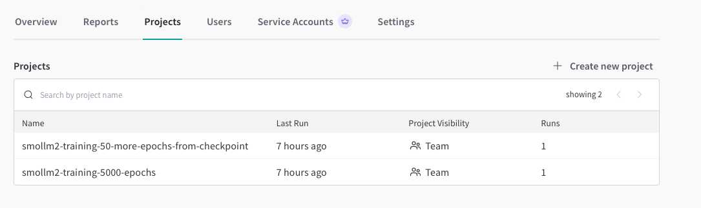
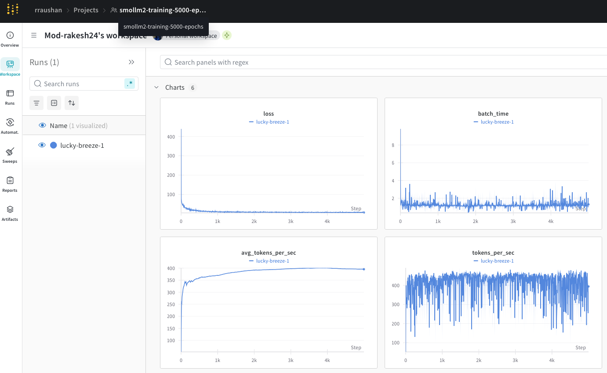
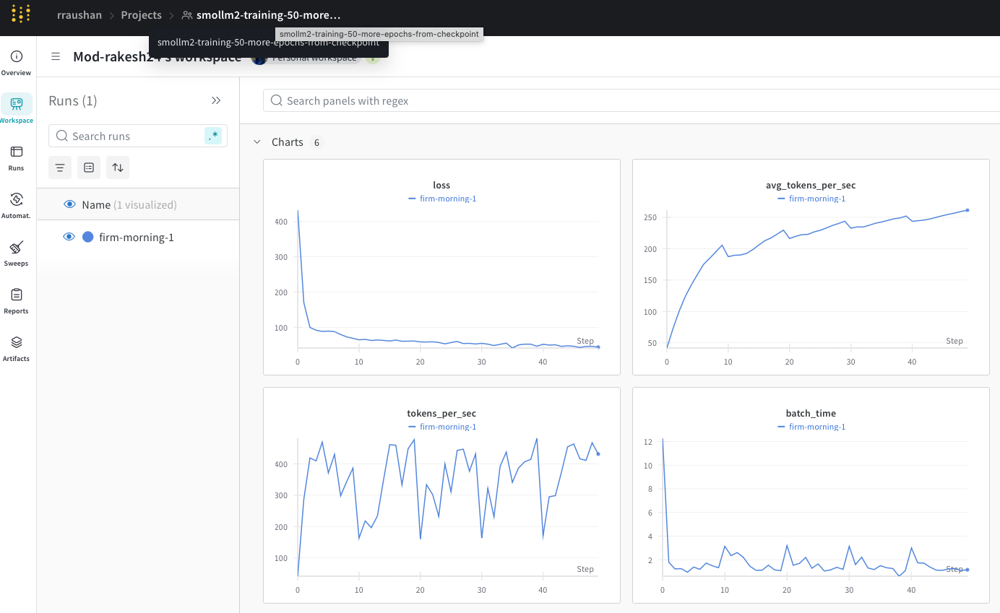

# SmolLM2 Training Implementation

This project implements training and fine-tuning code for a LLaMA-based language model inspired by SmolLM2. It includes features like Grouped Query Attention (GQA), proper tokenization handling, and efficient training with mixed precision.

## Try it out!

- 🚀 [Live Demo](https://huggingface.co/spaces/Perpetualquest/smolLm2-implementation)

## Model Definition

### Model summary comparision from original model smolLM2

<p float="left">
  
  
</p>


## Training Logs from weights and biases visualization

<p float="left">
  
  
  
</p>

### Key Components

#### 1. **LlamaRMSNorm**
- Implements Root Mean Square Layer Normalization, an alternative to standard layer normalization.
- **Purpose**: Normalizes the input by dividing it by the root mean square of its features, helping stabilize training and improving numerical stability.

#### 2. **LlamaRotaryEmbedding**
- Adds positional information to the token embeddings using rotary positional encoding.
- **Purpose**: Encodes the relative positions of tokens, essential for capturing the sequence order in attention mechanisms.
- **Mechanism**:
  - Computes sinusoidal and cosinusoidal embeddings based on token positions.
  - Used during the attention calculation to embed positional information directly into the query and key vectors.

#### 3. **LlamaAttention**
- Implements a multi-head attention mechanism with support for multi-query attention.
- **Key Features**:
  - Supports causal masking for autoregressive tasks (e.g., language modeling), ensuring tokens only attend to their past.
  - Uses separate projections (`q_proj`, `k_proj`, `v_proj`) for queries, keys, and values.
  - Multi-query attention reduces memory and computational costs by sharing key-value projections across multiple heads.

#### 4. **LlamaMLP**
- Implements a feed-forward neural network layer in the transformer architecture.
- **Structure**:
  - First projects the hidden states to a higher-dimensional space (`intermediate_size`).
  - Applies activation (SiLU), a smooth non-linear function.
  - Projects back to the original dimension (`hidden_size`).
- **Purpose**: Adds non-linearity and capacity for learning complex patterns.

#### 5. **LlamaDecoderLayer**
- Represents a single decoder layer in the transformer.
- **Components**:
  - **Attention Sub-Layer**: Processes self-attention.
  - **Feed-Forward Sub-Layer (MLP)**: Learns higher-level representations.
  - **RMSNorm Layers**: Stabilize the inputs to both sub-layers.
  - Residual connections add the original input back after each sub-layer, aiding gradient flow.
- **Purpose**: Forms the core of the decoder stack.

#### 6. **LlamaModel**
- Combines the embeddings, multiple decoder layers, and final normalization.
- **Steps**:
  - Embeds input token IDs (`embed_tokens`).
  - Processes embeddings through a stack of `LlamaDecoderLayer`.
  - Applies final normalization to the output.
- **Purpose**: Encodes token sequences into hidden representations.

#### 7. **LlamaForCausalLM**
- Adds a language modeling head (`lm_head`) on top of the `LlamaModel`.
- **Purpose**: Maps the final hidden states to vocabulary logits for predicting the next token in an autoregressive manner.
- **Optional Weight Tying**: Shares weights between the embedding layer and the output projection layer to reduce the parameter count and improve generalization.

---

### Salient Features of the Architecture

#### Causal Masking
- Ensures tokens can only attend to past tokens and not future ones.
- Useful for tasks like text generation or completion.

#### Multi-Query Attention
- Instead of having separate key-value projections for each attention head, uses fewer key-value projections (shared across heads).
- Reduces memory overhead and speeds up inference without significantly affecting performance.

#### Rotary Positional Embeddings
- Integrates positional encoding directly into attention computation.
- Efficient and less memory-intensive than traditional positional embeddings.

---

### Key Parameters
- `hidden_size`: Dimension of embeddings and hidden layers
- `num_hidden_layers`: Number of transformer layers
- `num_attention_heads`: Number of query attention heads
- `num_key_value_heads`: Number of key/value heads (smaller than query heads for GQA)
- `intermediate_size`: Dimension of feedforward layer
- `vocab_size`: Size of vocabulary (automatically adjusted to match tokenizer)

## Overall implementation details

- LLaMA-based architecture with Grouped Query Attention
- GPT2 tokenizer with custom special tokens for code and documentation
- torch.set_float32_matmul_precision('high') to speed using a lower precision than the default "highest"
- Mixed precision training with gradient scaling
- Checkpoint saving and loading for training continuation
- Performance metrics tracking (tokens/sec, batch time)
- WandB integration for experiment tracking
- Support for both CUDA and CPU training
- Automatic device detection and optimization

## Requirements
```bash
pip install -r requirements.txt
```

## Project Structure

- `train.py`: Main training script with checkpoint management
- `model.py`: Model architecture implementation
- `config.json`: Model configuration
- `tokenizer_config.json`: Tokenizer configuration
- `requirements.txt`: Project dependencies

## Usage

### Initial Training
```bash
python train.py
```

This will:
1. Initialize the model with configuration from `config.json`
2. Set up the tokenizer with special tokens
3. Train for 5000 steps
4. Save checkpoints every 500 steps
5. Log metrics to WandB

### Continue Training from Checkpoint
```bash
python train.py # with continue_training uncommented
```
Or manually:

```python
from train import continue_training
continue_training("checkpoints/checkpoint_5000.pt", "config.json", additional_steps=50)
```

## Training Configuration

The training script includes several configurable parameters:

- `total_steps`: Total number of training steps
- `checkpoint_every`: Frequency of checkpoint saving
- `project_name`: WandB project name
- `Learning rate`: 3e-4 (AdamW optimizer)
- `Batch size`: Dynamic based on input
- `Sequence` length: 512 tokens

## Tokenizer

Uses GPT2 tokenizer as base with additional special tokens for:
- Code markers (`<|im_start|>`, `<|im_end|>`)
- Repository information (`<repo_name>`, `<reponame>`)
- File separators (`<file_sep>`, `<filename>`)
- Jupyter notebook markers (`<jupyter_start>`, `<jupyter_text>`, etc.)

## Performance Tracking

The training script tracks and logs:
- Loss values
- Tokens processed per second
- Average batch processing time
- Total tokens processed
- Sample text generation at checkpoints

## Contributing

We welcome contributions! Feel free to raise PRs! 🙌
