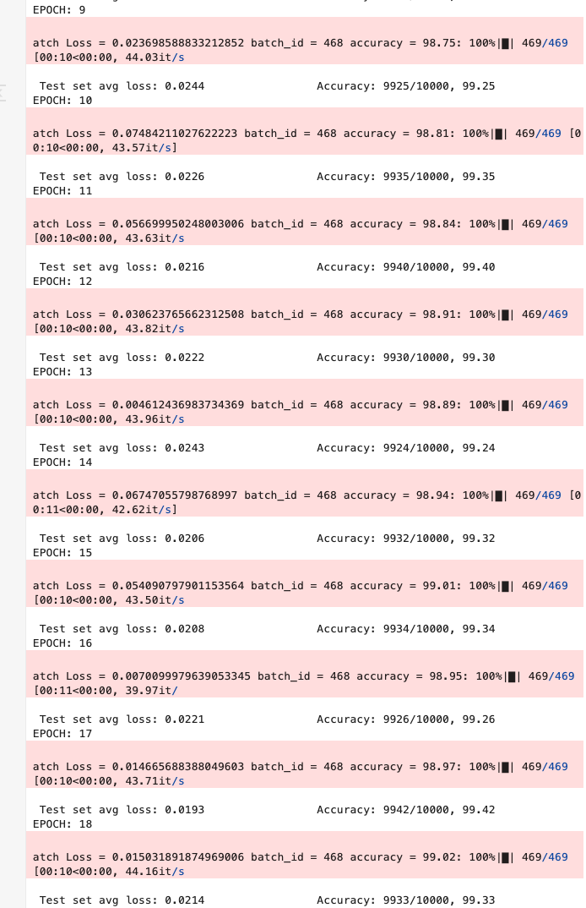

# ERA V3 Assignment 6 - Model Architecture Checks

This repository contains a PyTorch CNN model for MNIST classification with specific architectural requirements and automated checks using GitHub Actions.

## Model Architecture Requirements

The model is checked for the following requirements:
1. Total parameter count should be less than 20,000
2. Must use Batch Normalization
3. Must use Dropout
4. Must use either Global Average Pooling (GAP) or Fully Connected Layer

## Model Performance

The model achieves high accuracy on the MNIST test set:
- Reaches test accuracy of 99.42% (9942/10000) at epoch 17
- Shows consistent improvement in accuracy throughout training
- Efficient training with a small parameter count (15,752 parameters)
- Achieves multiple high accuracy points:
  - Epoch 11: 99.40%
  - Epoch 17: 99.42%
  - Maintains >99.30% accuracy consistently after epoch 14

Here are the training logs showing the model's performance:



## Repository Structure

- `network.py`: Contains the PyTorch model implementation
- `test_model.py`: Contains automated tests for model architecture requirements
- `.github/workflows/model_checks.yml`: GitHub Actions workflow configuration
- `requirements.txt`: Python dependencies
- `images/`: Contains training logs and other images
- `.gitignore`: Specifies which files Git should ignore
- `data/`: MNIST dataset directory (automatically created, not tracked in Git)

Note: The MNIST dataset will be automatically downloaded when running the notebook or tests, but is not tracked in Git.

## Architecture Test Results

The model passes all architectural requirements as shown in the test output below:

```
=========================================== test session starts ============================================
platform darwin -- Python 3.12.3, pytest-8.3.4, pluggy-1.5.0
collected 4 items                                                                                          

test_model.py::test_parameter_count PASSED                                                           [ 25%]
test_model.py::test_batch_normalization PASSED                                                       [ 50%]
test_model.py::test_dropout PASSED                                                                   [ 75%]
test_model.py::test_gap_or_fc PASSED                                                                [100%]

======================================= 4 passed in 4.24s =======================================
```

## Setup and Running Tests

1. Clone the repository
2. Create a virtual environment:
   ```bash
   python3 -m venv venv
   source venv/bin/activate  # On Windows: venv\Scripts\activate
   ```
3. Install dependencies:
   ```bash
   pip install -r requirements.txt
   ```
4. Run tests:
   ```bash
   pytest test_model.py -v
   ```

## GitHub Actions

The repository is configured with GitHub Actions to automatically run these tests on:
- Every push to the main branch
- Every pull request to the main branch

You can view the test results in the "Actions" tab of the GitHub repository. 